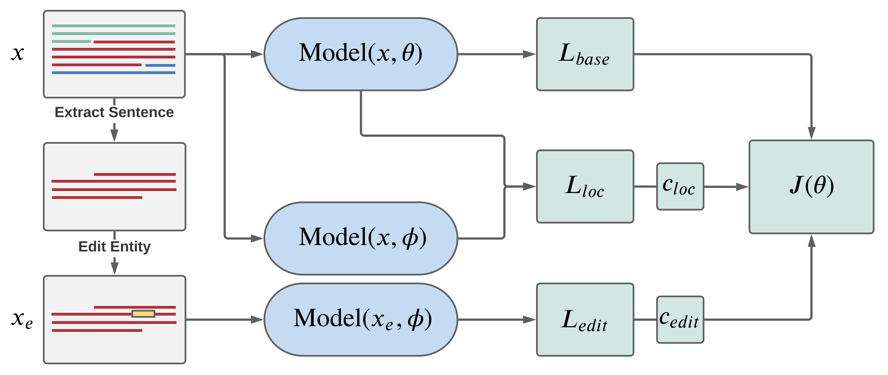

# Selectively Editable Language Models

2021-07-14

The post belows explains a project in editing language models I completed as part of Stanford's course in natural language processing. If you want to skip to the point, the [report](http://web.stanford.edu/class/cs224n/reports/final_reports/report032.pdf) and [code](https://github.com/spencerbraun/editable_nlp) are freely available.

## Background: Taming Large Language Models

Large language models have been an area of exciting development in the last few years, and we now have applications and entire companies built around their improving performance and utility. The number of pretrained models hosted on [Hugging Face](https://huggingface.co/models) has exploded, companies built on GPT-3's API are rolling out betas, and [GitHub Copilot](https://copilot.github.com/) [amazes](https://twitter.com/jeremyphoward/status/1417331228752023554?s=20) senior ML researchers (though not without controversies). All of these language models - from encoders like BERT variants, to decoders like GPT-3 or encoder-decoders like T5 and BART - rely on hundreds of hours of pretraining, unsupervised methods to endow the model parameters with familiarity in natural language's syntax and semantics. While incredibly useful, this task also encodes [specific factual knowledge](https://arxiv.org/pdf/2012.07805.pdf) in the model that remains static over time, despite changing facts on the ground in the real world. Fine-tuning these models on a specific task or dataset is quite common but is a costly and non-localized method for changing a specific fact learned during pretraining. Performance continues to improve in increasing model size, so any believer in the [scaling hypothesis](https://www.gwern.net/Scaling-hypothesis) should only expect model alteration to become a more pressing problem (at least in the near future).

With this in mind, I set out to explore alternative methods of knowledge editing - ways in which we could update a specific fact and its context without degrading a model's performance on unrelated language samples. Concretely, imagine a setting in which a model is deployed to generate sentences based on political news stories that occurred each day. If that model was pretrained on a text dataset created 5 years ago, a prompt like "New policies announced by the President,..." would likely fail to produce the correct name.

With the guidance of Eric Mitchell, a CS PhD student in the Stanford AI Lab, I extended an existing framework for editing deep learning models to the space of autoregressive transformer decoders.

## Editable Neural Networks

Selectively editing neural network outputs is not novel, though methods investigated vary widely in their approaches and implementation. One paper that seemed especially relevant was ["Editable Neural Networks,"](https://arxiv.org/pdf/2004.00345.pdf) published by Sinitsin et al. as a conference paper at ICLR 2020. They view editing through an error-correction lens and propose a training approach that can reliably alter mistaken network output while minimizing overall disturbance and computational requirements relative to other approaches. With their technique termed "Editable Training,” the authors employ meta-learning to push model parameters towards specific objectives. The model should be fine-tuned on the specific base learning task at hand (eg. minimize cross entropy on a language dataset or classification error on ImageNet) while also learning to be adaptable when we change the gold label for a given example. Once the model has been trained with this procedure, it should be primed for quick edits to its outputs using just a few gradient steps. Sinitsin et al. explore image classification and neural machine translation use cases but do not touch on language model settings.

## Meta-Learning: Learning to Learn

For many practitioners familiar with machine learning but without prior experience with meta-learning, it can be an unintuitive concept to grasp. In vanilla neural network training, an objective is specified by a loss function, the loss is evaluated over some training samples, and the parameters are updated by small steps in a direction that decreases this loss by some form of gradient descent. In meta-learning, there are multiple objectives and the model parameters are trained to be adaptable to several, sometimes competing, tasks. Instead of evaluating the training success over a concrete metric, we are endowing the model with the ability to learn faster in the future.

I specifically focused on a type of meta-learning known as MAML - model-agnostic meta-learning - introduced by [Finn et al.](https://arxiv.org/pdf/1703.03400.pdf) in 2017. As they describe in the problem set-up:

> The goal of few-shot meta-learning is to train a model that can quickly adapt to a new task using only a few data points and training iterations.  To accomplish this,  the model or learner  is  trained  during  a  meta-learning  phase  on  a  set of tasks, such that the trained model can quickly adapt to new tasks using only a small number of examples or trials. In effect, the meta-learning problem treats entire tasks as training examples.

What does this look like in practice? There are some excellent tools available for MAML, and I found Facebook's PyTorch add-on [Higher](https://github.com/facebookresearch/higher) to be quite easy to use. It allows us to grab the model parameters, compute intermediate gradients, and take some gradient steps functionally. Important to understand is the distinction between the "inner loop" and "outer loop” of MAML. I found the description provided by Zintgraf et al. in ["Fast Context Adaptation via Meta-Learning"](https://arxiv.org/pdf/1810.03642.pdf) quite clear:

> MAML is trained with an interleaved training procedure, comprised of inner loop and outer loop updates that operate on a batch of related tasks at each iteration. In the inner loop, MAML learns task-specific network parameters by performing one gradient step on a task-specific loss. Then, in the outer loop, the model parameters from before the inner loop update are updated to reduce the loss after the inner loop update on the individual tasks. Hence, MAML learns a model initialisation that can generalise to a new task after only a few gradient updates at test time.

In code, the training process looks like:

```python
# init an "outer loop" optimizer for the total loss
opt = torch.optim.Adam(model.parameters(), lr=1e-5)

# loop over data batches containing a base objective example and meta-learning task example
for train_step, (base_example, meta_example) in enumerate(dataloader):

    # init an "inner loop" optimizer for meta-learning gradient steps
    inner_opt = torch.optim.SGD(model.parameters(), lr=1e-3)

    # higher takes in model and optimizer
    with higher.innerloop_ctx(
        model,
        inner_opt,
        copy_initial_weights=False, # by not copying weights, we directly alter the model parameters
        track_higher_grads=True
        ) as (fmodel, diffopt): #returns functional model and optimizer

        # specify number of gradient steps in meta-learning objective
        for _ in range(num_grad_steps):

            # calculate loss on meta-learning objective
            loss = fmodel(meta_example).loss
            # take an optimizer step
            diffopt.step(loss)

        edit_loss = fmodel(meta_example).loss
        # calculate loss on base objective
        base_loss = model(base_example).loss

        # backprop and optimizer step
        total_loss = base_loss  + alpha * edit_loss
        total_loss.backward()

        opt.step()
        opt.zero_grad()
```

In the snippet above, you can get a sense of how MAML is implemented in practice. For more on MAML and meta-learning, I highly recommend [this excellent blog](https://lilianweng.github.io/lil-log/2018/11/30/meta-learning.html) post by Lillian Weng.

## Experiments

I focused on a single toy setting - altering the names associated with a person in a given context. My approach incorporated several distinct steps to build and evaluate what I termed the "language editing” procedure. First, I constructed a novel dataset consisting of an unedited passage, a sentence of the passage with a permuted named entity, and a record of the named entity changed. Second, a MAML training architecture was written allowing for optimization over both a typical language model cross-entropy loss along with an "adaptability" loss. Finally, performance measures were created to understand how the language editing procedure altered model parameters and highlight areas for future improvement.

### Data

The dataset was generated using WikiText-103, available on the [Hugging Face datasets hub](https://huggingface.co/datasets/wikitext). I used a SpaCy named entity recognition model to collect all named persons and create pairs of original sentences and copies with swapped names.

### Model

I used a pretrained [DistilGPT2](https://huggingface.co/distilgpt2) model, an autoregressive transformer language model with fewer parameters than a typical GPT-2 model. This was chosen out of practicality, as MAML stores a copy of the model parameters in memory.

### Objectives

Following the example set by Sinitsin et al., I evaluated three losses that were weighted and backpropagated through the network. In the inner-loop optimization, the model parameters were pushed to learn the edited named entity via a cross-entropy loss. In the outer-loop optimization, the edit loss is defined as the cross-entropy of the altered MAML model on the edited sentence. The base loss is the original model's cross-entropy on the unedited passage. Finally a locality loss is imposed by taking the KL divergence between the probabilities output by the original and meta-learned model on the same passage. This attempts to preserve the meta-learned model's performance on unedited samples. For more details, I suggest reading section 3 of the report.



## Results: Locality is Key

After several ablations, I found that this training procedure could allow a pretrained decoder to pretty effectively incorporate a simple edit with minimal change in overall perplexity on the validation set. This result was especially promising given the lack of success when the edit was applied to a simply fine-tuned model.

However, the result leads to obvious questions about the practicality of the experimental setting. I attempted to have the language model update on a single edit after the MAML procedure, but in a deployed model we likely would want to make hundreds of edits each month. I have been performing more research on varied editing settings and hope to find a robust methodology.

One lesson that I found to be key in this project is the importance of minimizing model degradation on other, non-edited samples. There were many hyperparameter settings that allowed for successful output editing, but many came with a high cost to the overall perplexity of the model. Looking at the actual language produced by these degraded models demonstrated that even small changes in parameters could render the models useless.

This all suggests that model editing is a rich area of research with many problems yet to be solved. I encourage you to check out the [project report](http://web.stanford.edu/class/cs224n/reports/final_reports/report032.pdf) and [code](https://github.com/spencerbraun/editable_nlp) if interested.
